# Portfolio Project

## My Website

[The website](https://ashamaly.github.io/portfolio/)
[Github](https://github.com/Ashamaly/portfolio)

### Purpose

The purpose of this portfolio project was to practice and implement front-end coding skills learned at Coder Academy as well as doubling as a way to showcase those skills to my peers and potential employers. It's an interesting experience executing the lessons learned in class as well as developing and learning new skills in the process.

### Functionality 

From the start, this website was created desktop first and used exclusively div tags but I realized quickly the shortcomings of this approach accessibility wise. So I refactored it to use appropriate tags where I could (headers, footers, nav tags etc.). I also prioritized mobile first and then scaled the design up to suit larger devices. The site is mostly monochromatic to make it easy to see different elements, buttons have been made large and easy to read/click/touch and I tried to select fonts and styling that were easy to read.

### Sitemap and Wireframes

These are the wireframes and sitemap I drew up to refer back to.

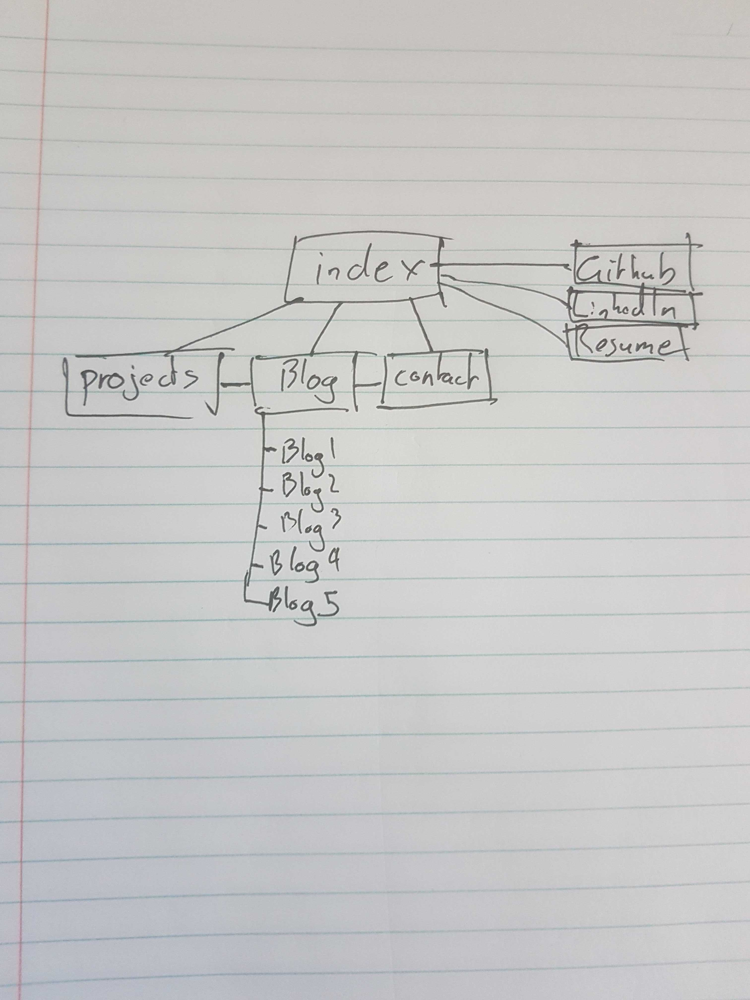

#### Desktop

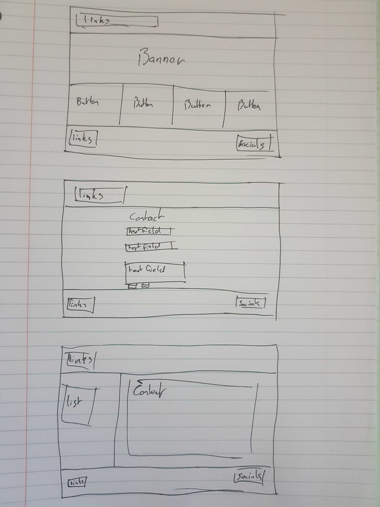

#### Mobile

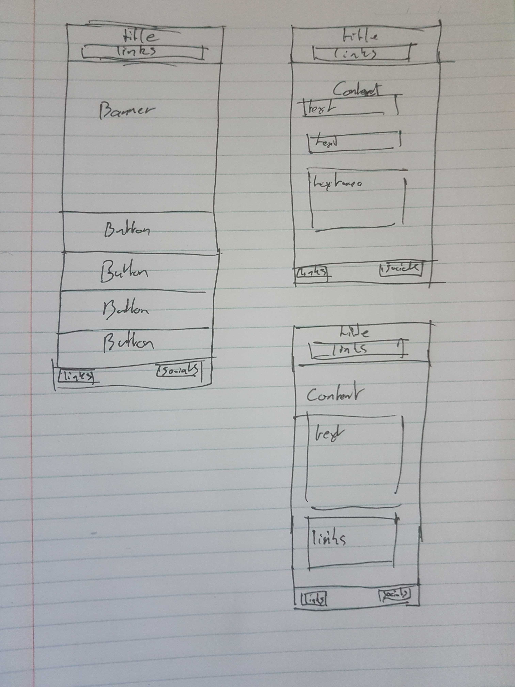

### Screenshots

#### Desktop

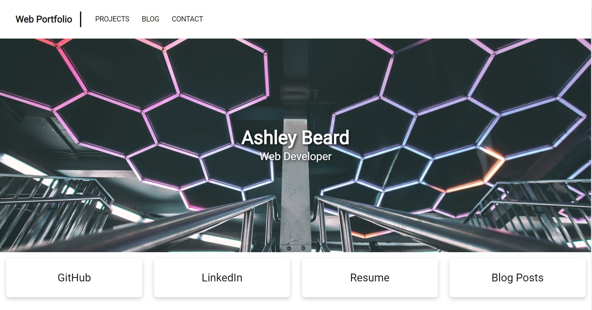

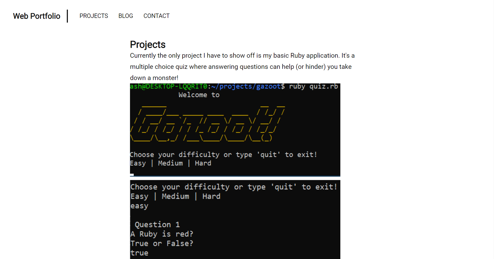

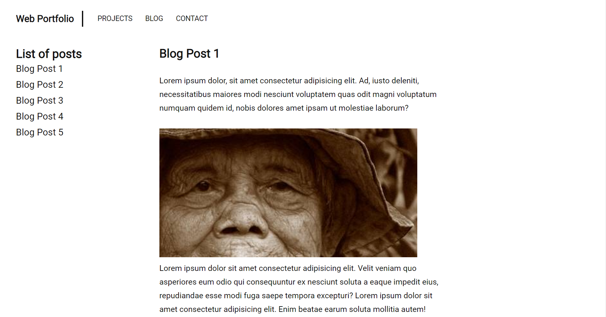

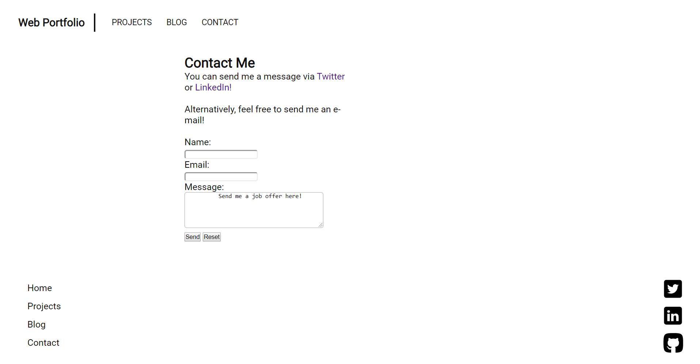

#### Mobile

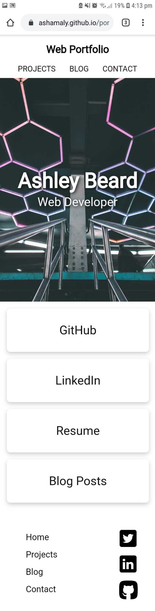

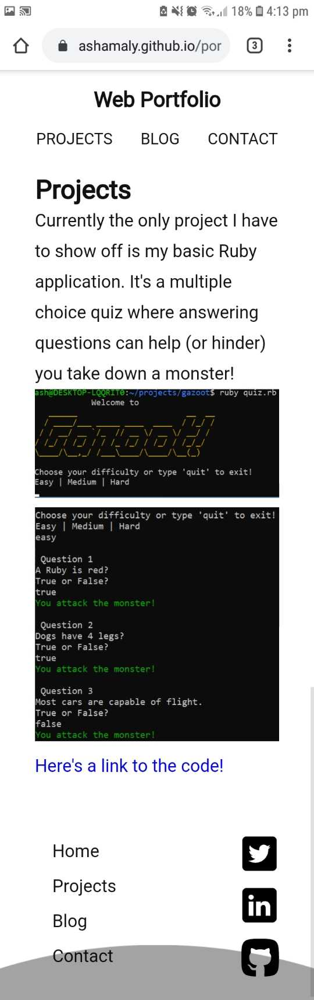

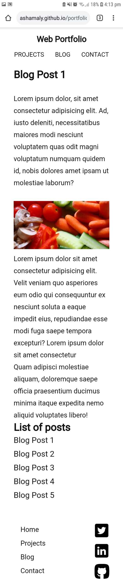

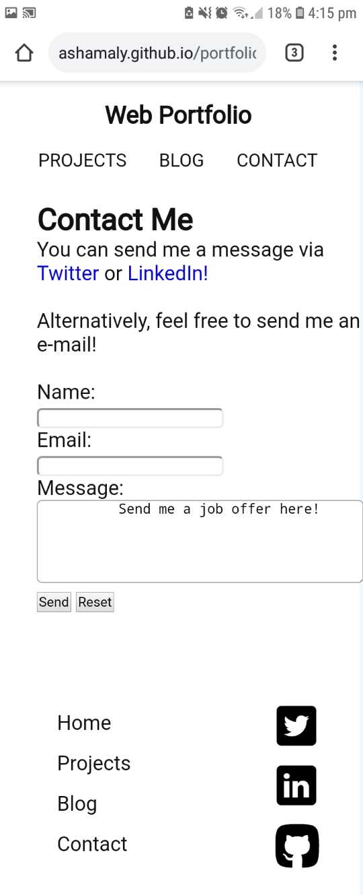

### Target Audience

The site is aimed to showcase basic html/css and design skills to potential employers as well as other developers. I tried to accomodate as many types of people accessibility wise and took a simple "minimalist" design approach to try and accomplish this as best I can.

## Tech Stack

The website was built with HTML5 and styled with CSS and the google fonts API.